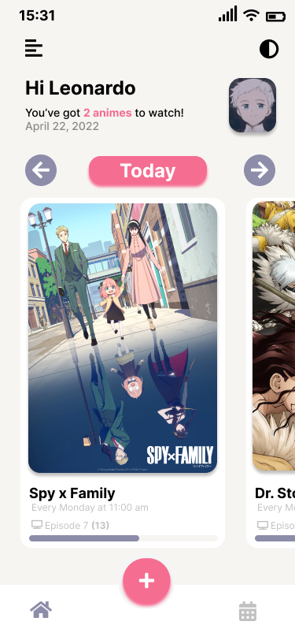
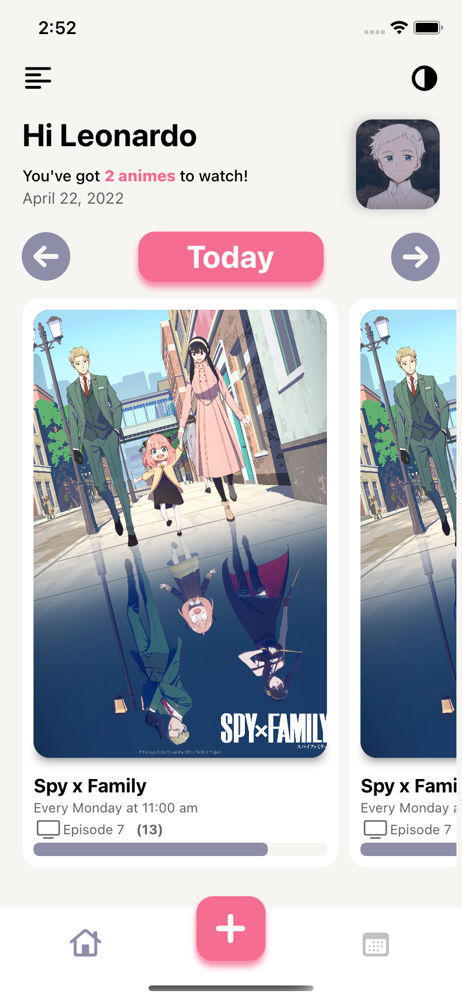
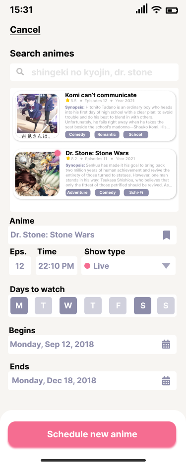
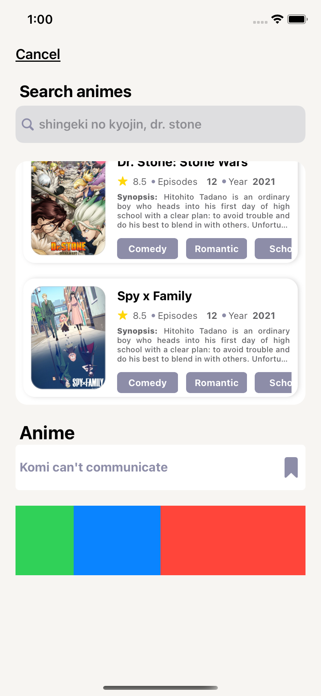
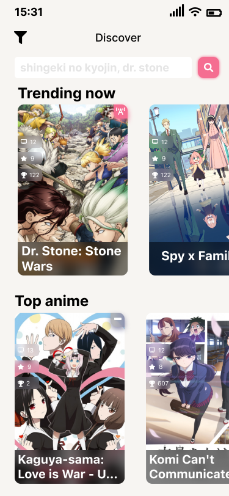

# 📅 Anime Calendar
Anime Calendar's iOS App - Schedule your seasonal anime to watch!

## 🚧 Project State
AnimeCalendar was put in hiatus for several months due to many changes happening in my life, including work & time constraints. However, after organizing my own life calendar/schedule, no pun intended lol, AC is **back in development!**. Any UI, or feature ideas feel free to make a PR.

## 📐 Architecture
AnimecCalendar uses the **VIPER** arch., with some twists, for creating and maintaining modules. It's planned to have different frameworks for specific services like UserNotifications, Style, etc. Some **design patterns** used are:
- Singleton
- Factory

## 🌇 UI
Uses Xibs and some programmatic views.

## ⚙️  Dependencies
Current dependencies used, not planning to add more
- RxSwift (w/ RxCocoa/RxRelay)

## ⛩️ Setup
Currently, the project structure aims to make every screen a *root screen* meaning the app can boot from any screen in the app. The `BootManager.swift` module is in charge of said logic. You can boot the app with `.rootTabBar` or a specific `.rootScreen(ScreenType)`.
```swift
func scene(_ scene: UIScene, willConnectTo session: UISceneSession, options connectionOptions: UIScene.ConnectionOptions) {
    guard let windowScene = (scene as? UIWindowScene) else { return }
    let bootManager = BootManager()

    // Boot from .newAnimeScreen
//    let rootController = bootManager.getRootController(.rootScreen(screen: .newAnimeScreen))
    let rootController = bootManager.getRootController(.rootTabBar) // Main boot

    let rootViewController = rootController.getRootViewController()

    window = UIWindow(frame: windowScene.coordinateSpace.bounds)
    window?.windowScene = windowScene
    window?.rootViewController = rootViewController
    window?.makeKeyAndVisible()
  }
```

## 📹 Demos
| Home | New Anime |
| ---| --- |
|  |  |

## 📸 Screenshots
### Home
| Figma | iOS |
| --- | --- |
|  |  |

### Schedule new anime
| Figma | iOS |
| --- | --- |
|  |  |

### Discover (New!)
| Figma | iOS |
| --- | --- |
|  | |

## Todo
Small Todo's yet to complete, will be filling out periodically. 
- [x] HomeScreen UI
- [x] Make TabBar's View custom middle button work, presenting NewScheduledAnime screen.
- [x] Refactor BootManager
- [x] Convert modules into VIPER arch.
- [ ] Cache Images retrieved from both Network & Local
- [ ] ~~Animate NewScheduledAnime presentation when its TabBar button is pressed~~
	- It's no longer a TabItem inside the TabBar
- [x] Middle button presenting NewScheduledAnimeScreen
- [x] NewScheduledAnimeScreen design, for live anime
- [ ] NewScheduledAnimeScreen design, for live ended anime
- [ ] NewScheduledAnimeScreen design, for live custom anime
- [x] Cancel (dismiss NewAnime screen) attributed string title and functionality
- [ ] ViewModels for Screen/Components
- [ ] UseCases for Screen/Components
- [ ] Repository (With dummy repository for reading local JSON mock data)contracts & implementation
- [ ] NetworkLayer (Deploying TS' API)
- [ ] CacheLayer
- [ ] LocalStorage layer (Realm)
- [ ] Firebase connection
