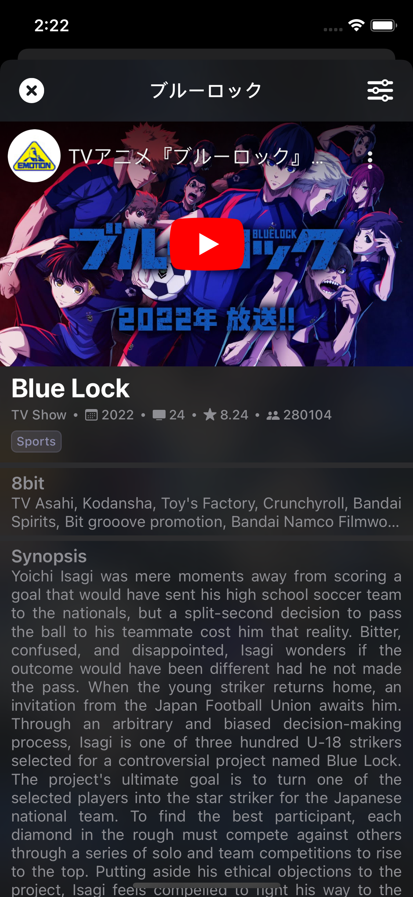
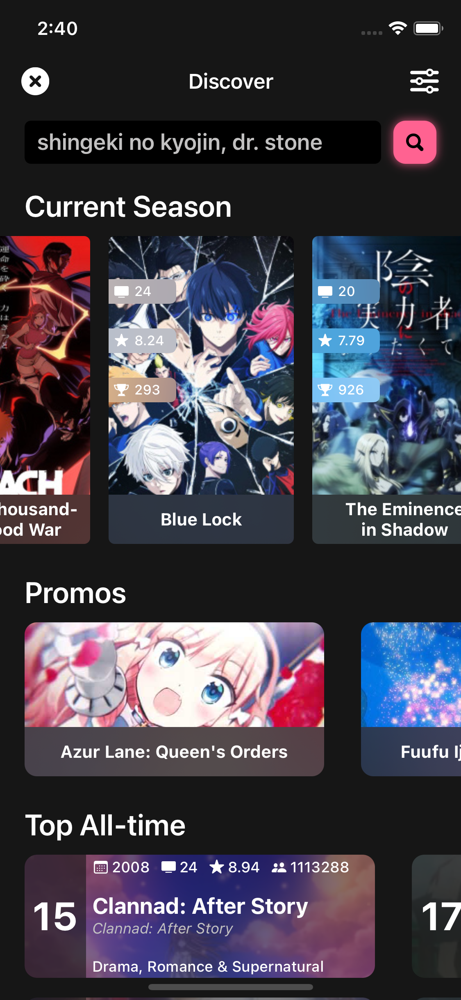

# 📅 Anime Calendar
Anime Calendar's iOS App - Schedule your seasonal anime to watch!

## 🚧 Project State
AnimeCalendar was put in hiatus for several months due to many changes happening in my life, including work & time constraints. However, after organizing my own life calendar/schedule, no pun intended lol, AC is **back in development!**. 
#### Any UI, or feature ideas feel free to make a PR or check the current [issues](https://github.com/Estremadoyro/AnimeCalendar-iOS/issues).

## 📐 Architecture
AnimecCalendar uses the **VIPER** arch., with some twists, for creating and maintaining modules. It's planned to have different frameworks for specific services like UserNotifications, Style, etc. Some **design patterns** used are:
- Singleton
- Factory

## 🌇 UI
Uses mostly programmatic views and some Xibs. No storyboards.

## ⚙️  Dependencies
Current dependencies used:

- [RxSwift](https://github.com/ReactiveX/RxSwift) - Reactivity in the app (Aiming to eventually move to Combine)
- [Nuke](https://github.com/kean/Nuke) - Managing images in a fast/easy manner.
- [youtube-ios-player-helper](https://github.com/youtube/youtube-ios-player-helper) - Loading trailers with a Google-YT-native player embed in the app.

## ⛩️ Setup
Currently, the project structure aims to make every screen a *root screen* meaning the app can boot from any screen in the app. The `BootManager.swift` module is in charge of said logic. You can boot the app with `.rootTabBar` or a specific `.rootScreen(ScreenType)`.
```swift
func scene(_ scene: UIScene, willConnectTo session: UISceneSession, options connectionOptions: UIScene.ConnectionOptions) {
    guard let windowScene = (scene as? UIWindowScene) else { return }
    let bootManager = BootManager()

    // Boot from .newAnimeScreen
//    let rootController = bootManager.getRootController(.rootScreen(screen: .newAnimeScreen))
    let rootController = bootManager.getRootController(.rootTabBar) // Main boot

    let rootViewController = rootController.getRootViewController()

    window = UIWindow(frame: windowScene.coordinateSpace.bounds)
    window?.windowScene = windowScene
    window?.rootViewController = rootViewController
    window?.makeKeyAndVisible()
  }
```

## 📹 Demos
| Home | Discover | Anime Detail |
| ---| --- | --- |
|  |  |  |

## 📸 Screenshots
### Anime Detail (New!)
| Part-1 | Part-2 |
| --- | --- |
|  |  |

### Discover (New!)
| Discover new anime |
| --- |
|  |

### Home
| Home (UI first version) |
| --- |
|  |

## Todo
Small Todo's yet to complete, will be filling out periodically. 
- [x] Managing images with Nuke (3rd-party).
- [x] Loading YT trailer videos (3rd-party).
- [ ] TrailerComponent black screen when loaded (Fixed when scrolling 1point).
- [x] BasicAnimeInfoCell (Name, rating, episodes, producers, studios, snyopsis).
- [x] Characters collection.
- [x] Loading indicator for async. additional requests to a specific anime.
- [ ] Integrate with AnimeSchedule-API for better anime schedule info & +rate-limit https://animeschedule.net/api/v3/documentation/anime.
- [ ] Add logging & user authentication optional for sync. with AnimeSchedule.
- [ ] The whole scheduling service.
- [ ] Storing scheduled anime in locally with CoreData (It's gonna hurt)

###### A 🌟 would be highly appreciated!! Keeps me motivated to eventually get this app released to the AppStore by 2023!
